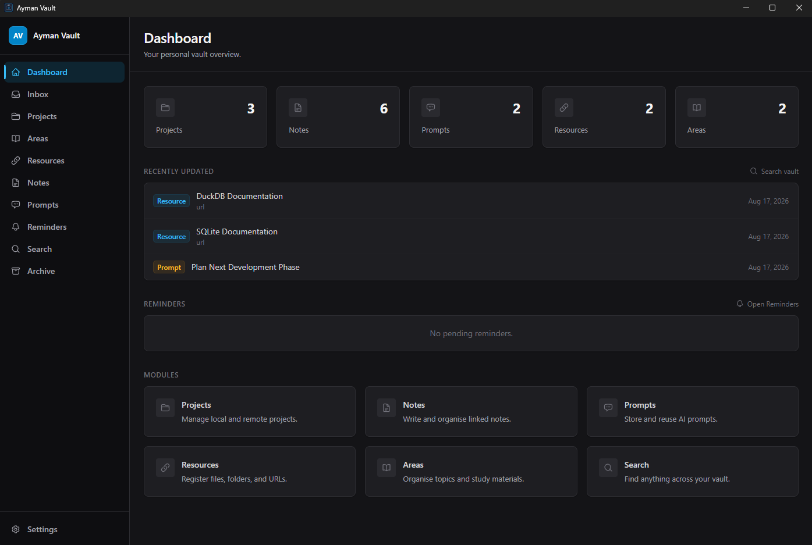
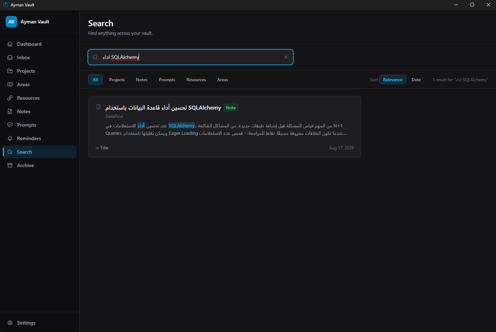
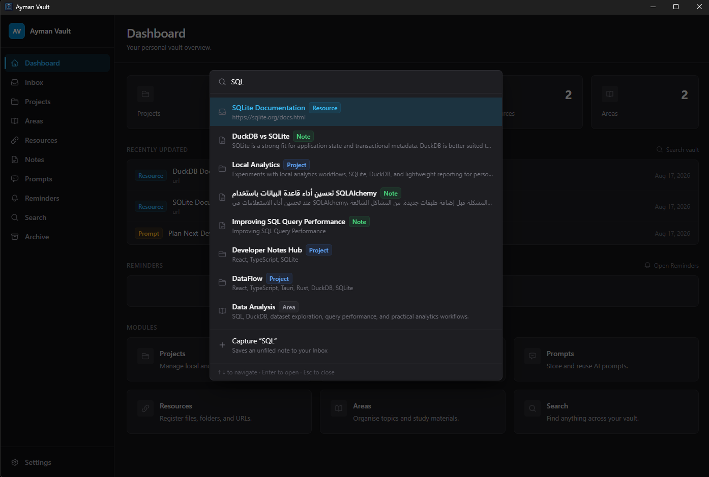
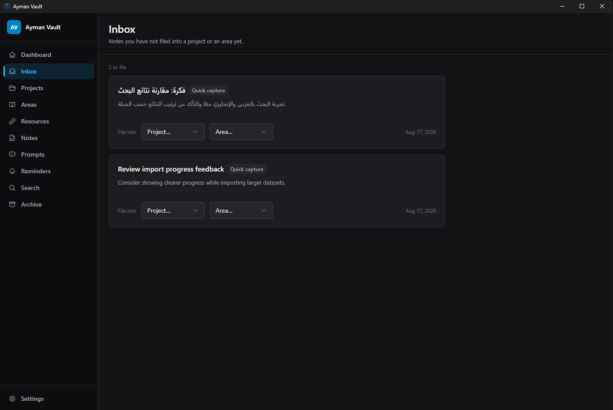
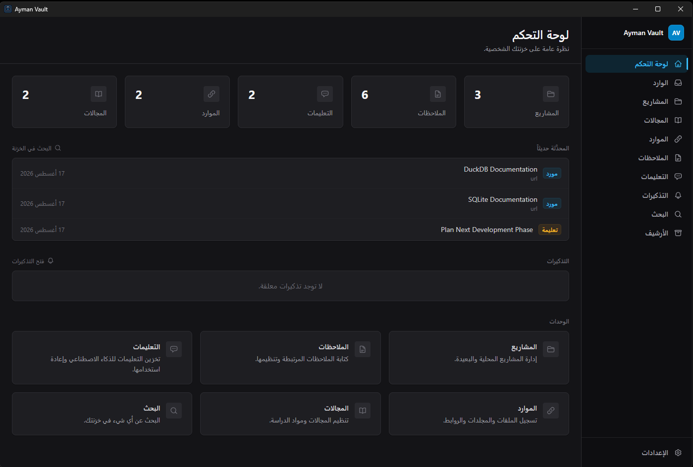
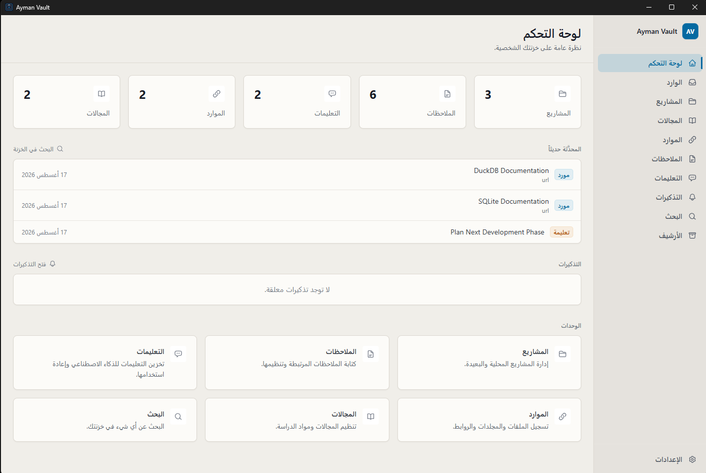

# Ayman Vault

A local-first personal workspace and evolving Second Brain for Windows.

> **Early Public Preview.** Ayman Vault is under active development. Features and the interface
> are still changing. Please keep backups of anything you care about.

---

## How this started

Ayman Vault did not start as a product. It started as a program I wanted for myself.

I kept losing track of my own work. Project folders in one place, notes in another, useful links
in a browser bookmark bar I never opened again, and the AI prompts I had spent real time refining
scattered across chat windows. I wanted one local place to keep all of it, and I did not want to
depend on a hosted service to hold my own notes.

There was a second reason, and honestly it mattered just as much. I wanted to find out how far a
personal project could actually go if I used AI as a development partner from the beginning — not
to generate a demo, but to build and maintain something I would use every day and would notice
immediately if it broke.

So I built it. Then I kept using it. And because I kept using it, I kept finding the next thing
it was missing.

## How it grew

Nothing here was planned as a roadmap up front. Each piece got added because the version I was
using at the time annoyed me in some specific way.

It began as a simple vault: **projects**, then **notes**, then **prompts**, then **resources**.
Once there was enough content in it, finding things became the problem, so search had to get
serious.

Along the way it picked up **local AI experiments** through LM Studio, then a small set of
**optional cloud AI tasks**, then **reminders**, then **Arabic and RTL support** because I use
both languages daily, then a proper **theme system**.

More recently the focus shifted toward making it behave like an actual second brain rather than a
set of lists: an **Arabic-aware full-text search engine**, a **PARA structure** with Inbox and
Archive, and a **Ctrl+K command palette** with **quick capture** so a thought can be saved in a
couple of seconds without leaving whatever page I was on.

That work is still going. See [Where this is heading](#where-this-is-heading).

---

## Screenshots

_Dashboard — dark theme_

_Arabic + English search with relevance highlighting. The query is written without the hamza —
`اداء` — and still matches `أداء` in the note, with both the Arabic and the English term
highlighted in the snippet._

_Ctrl+K command palette and Quick Capture — search everything, or save what you just typed
straight to the Inbox._

_Inbox for unfiled notes_

_Full Arabic RTL interface_

_Arabic RTL in light theme_

---

## What it does today

Everything in this section exists in the current build. Nothing here is planned or partial.

### Organization

- **Projects** — status, type, local folder, GitHub and live URLs, tech stack, important commands, notes
- **Areas** — ongoing topics or domains that group related material
- **Notes** — linked to a project or an area, with tags; ordinary, daily, and quick-capture kinds
- **Prompts** — reusable AI prompts with category, usage notes, tags, and optional project link
- **Resources** — files, folders, URLs, and other references with type-aware open actions
- **Inbox** — anything you have not filed into a project or an area yet
- **Archive** — move things out of your active workspace without deleting them
- **Attachments** — document references on Areas (PDF, DOC, DOCX, TXT, MD) and screenshot references on Projects (PNG, JPG, JPEG, WebP)

### Search

- Local full-text search across projects, areas, notes, prompts, and resources
- Relevance ranking, so the best match comes first rather than the most recent
- Highlighted snippets showing where the match actually is
- **Arabic-aware matching** — searching `احمد` finds `أحمد`, and diacritics and tatweel do not break results
- Mixed Arabic and English in the same query
- Search-as-you-type prefix matching
- Archived items stay out of normal results

### Capture

- **Ctrl+K** opens an in-app command palette from anywhere in the app
- Search your vault and jump straight to any result
- **Quick capture** — write a thought and save it as an unfiled note in your Inbox, without leaving the page you were on

### AI (optional)

AI is **off by default** and does nothing until you turn it on and explicitly ask for something.
There is no AI running in the background, at startup, or when a page loads.

**Local AI** runs against [LM Studio](https://lmstudio.ai/) on your own machine. Local tasks
include summarizing a note, cleaning up a prompt, asking a custom question about a single note or
prompt, generating a project summary, and generating implementation or review prompts for a
project.

**Cloud AI** is optional and separate. A small number of project-level tasks can use a cloud
provider you configure yourself (OpenAI, DeepSeek, or OpenRouter) with your own API key. See
[Privacy](#privacy) for exactly what that means.

Every AI action shows you the exact content it is about to use, before anything runs.

### Reminders

Local reminders with overdue and upcoming views, an in-app due banner, and a dashboard summary.
These are **in-app only** — they appear while Ayman Vault is open. There are no Windows
notifications, no background service, and nothing runs when the app is closed.

### Import and export

- Import notes from Markdown or TXT files, individually or a folder at a time
- Import prompts from Markdown
- Export notes to Markdown or TXT, individually or all at once
- Export prompts to Markdown

### Interface

- **English and Arabic**, with full right-to-left layout
- **Dark and light themes**
- Keyboard shortcuts for the command palette and creating new items
- Windows desktop application

### Your data

- Everything lives in a single local SQLite database on your machine
- Backup to a location you choose, and restore from any previous backup

---

## Privacy

This section is written to be precise rather than reassuring. Please read it before enabling AI.

### Your vault data

Your vault is a single SQLite database stored locally on your machine. There is:

- no hosted account and no sign-in
- no cloud synchronization
- no telemetry
- no analytics
- no crash reporting
- no update check
- no background upload of any kind

Ayman Vault does not send your vault anywhere. Storage is local, always.

### Local AI

When you use a local AI action, the request goes to the LM Studio server running on your own
machine. It does not leave your computer.

### Optional cloud AI

A small number of AI actions can use a cloud provider **if you choose to set one up**. This is the
only situation in which any content can leave your machine, so it works like this:

- Cloud AI is **optional** and disabled by default
- It only runs for a specific action you started yourself — never automatically, never in the background
- Before anything is sent, you are shown the **exact content** that will be sent, and you have to confirm it
- The content is **sanitized first**: local file paths, email addresses, and values that look like keys or tokens are removed
- It sends **only the one item you selected** — not your notes, not your whole vault
- If a local AI action fails, it is **never** silently retried against the cloud. There is no automatic local-to-cloud fallback
- Your API key is stored in the Windows Credential Manager, not in the vault database and not in backups

If you never configure a cloud provider, no content ever leaves your machine.

---

## Built while learning with AI

Part of why this project exists is that I wanted to see what modern AI development tools are
actually good for on a real, long-lived codebase rather than a weekend demo.

The split has been roughly this: I decide what the product should be, which features are worth
building, and which tradeoffs are acceptable. I run the application, test it, and reject things
that feel wrong. AI tools help with planning, implementation, debugging, review, and the tedious
parts of iteration.

That has meant a lot of reviewing, a lot of rejecting, and a lot of asking for things to be done
differently. The application was not generated autonomously, and I would not trust it if it had
been — the parts I care most about, like what can leave the machine, got the most scrutiny.

What I found interesting is how far one person can get this way. Ayman Vault is a real desktop
application with a local database, schema migrations, a search engine, two languages, two themes,
and a fairly careful privacy boundary. It is the kind of scope I would not have attempted alone.

---

## Download

**Ayman Vault v2.12.0 — Early Public Preview**, for 64-bit Windows.

### [⬇ Download the installer (.exe)](https://github.com/aymangh-0/ayman-vault/releases/download/v2.12.0/Ayman.Vault_2.12.0_x64-setup.exe)

Prefer an MSI? [Download the .msi instead](https://github.com/aymangh-0/ayman-vault/releases/download/v2.12.0/Ayman.Vault_2.12.0_x64_en-US.msi).

All versions and checksums are on the [Releases page](https://github.com/aymangh-0/ayman-vault/releases).

| | |
|---|---|
| **Version** | 2.12.0 — Early Public Preview |
| **Platform** | Windows, 64-bit (x64) |
| **Installers** | `.exe` (NSIS) and `.msi` |
| **Code signing** | Not signed — see the note below |
| **Updates** | No automatic updater |

Ayman Vault uses the Microsoft Edge WebView2 runtime, which is already present on current
Windows 11 installations.

There is no automatic updater. New versions are announced on the Releases page, and you install
them the same way you installed the first one — your vault is stored separately from the
application and carries over.

### A note on the installer warning

The current preview installers are **not code signed** yet, because code signing has not been set
up for this project.

Because of that, Windows may show a warning that the publisher is unknown when you run the
installer. This is the expected behaviour for unsigned software from an individual developer, and
it will keep happening until signing is in place.

Please make your own judgement about whether you are comfortable installing it. Do not turn off
Windows security features to install this or anything else.

---

## Known limitations

Being upfront about the rough edges in this preview:

- **Arabic word prefixes are not stripped.** Search matches whole words, so a word written with an
  attached prefix — `وقاعدة` rather than `قاعدة` — is found by the form you actually typed. Deeper
  Arabic stemming is not implemented yet.
- **Two different meanings of "archived" for projects.** A project can have an *Archived* status
  (a lifecycle state — the project still lives in your active list), and separately it can be moved
  to the *Archive* (which hides it from lists and search). The wording is confusing and will be
  revisited.
- **Ctrl+K does not open while you are typing in a text field.** This is deliberate, so the
  shortcut can never swallow a keystroke meant for the text you are editing. Click outside the
  field first.
- **Installers are unsigned**, as described above.
- **No confirmation message after a quick capture.** The palette simply closes. Your note is in the
  Inbox.
- **Windows only.** There are no macOS or Linux builds.

---

## Where this is heading

Ayman Vault is gradually moving toward a fuller second brain rather than a well-organized set of
lists. The direction I am exploring next:

- stronger connections between related notes, projects, and resources
- better retrieval, so the right thing surfaces without you remembering where you put it
- optional semantic search alongside the current keyword search
- deeper AI-assisted querying of your own vault content

**None of this is available today.** It is direction, not a promise, and anything in this list may
change or be dropped. Everything in [What it does today](#what-it-does-today) is what actually
ships right now.

---

## Status and feedback

This is an **early public preview**, not a stable release. It is under active development, the
interface is still changing, and you should keep backups of anything important.

Bug reports and feedback will be welcome here once public issue tracking is enabled.

---

## About this repository

This repository is for the product itself — documentation, release notes, downloads, and later,
issue reporting.

**Ayman Vault is not open source, and the application source code is not published here.** The
development repository is private. There are no build-from-source instructions, because there is no
public source to build.

Built with Tauri 2 (Rust), React, TypeScript, and SQLite.
